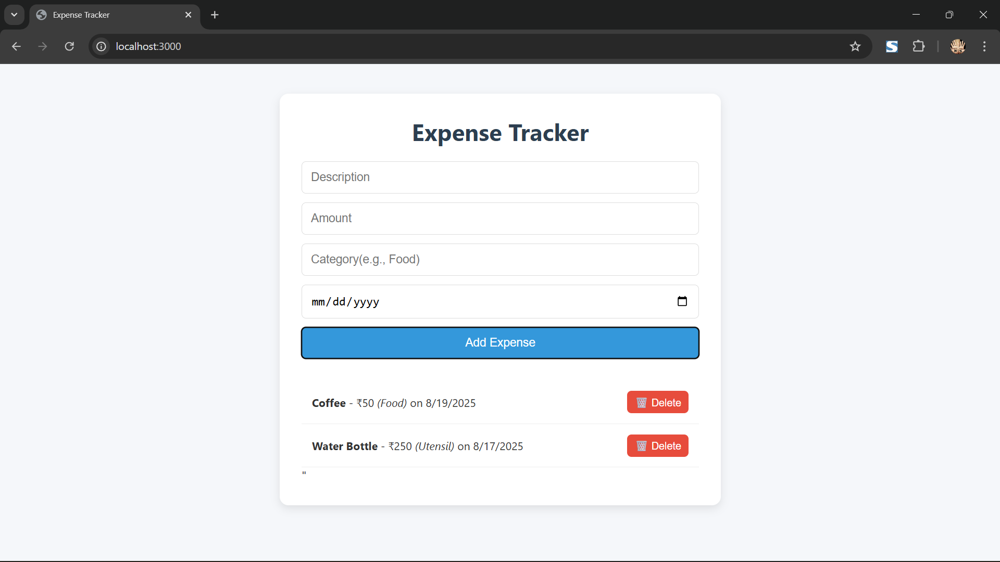
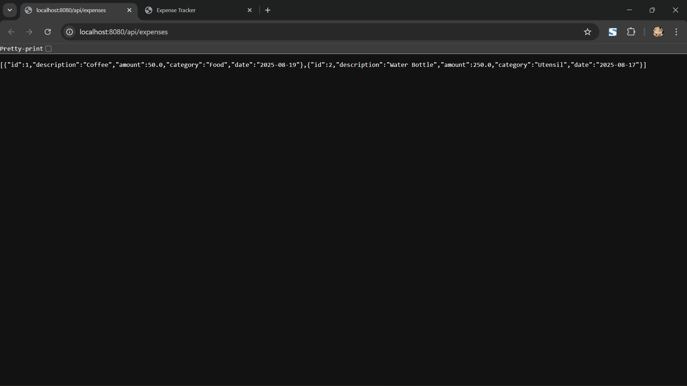

# 💸 Expense Tracker

A full-stack expense tracker web application built with **Spring Boot (Java)** and **vanilla JavaScript**.

Track your expenses, categorize them, and manage your budget with a clean, responsive UI.

  


## 🚀 Features

- ✅ Add new expenses (description, amount, category, date)
- ✅ View list of all expenses
- ✅ Delete expenses
- ✅ Data stored in **PostgreSQL**
- ✅ Responsive design (works on mobile & desktop)
- ✅ Full CRUD via REST API

## 🛠️ Tech Stack

| Layer       | Technology                     |
|-----------|--------------------------------|
| **Backend** | Spring Boot, JPA, PostgreSQL   |
| **Frontend** | HTML, CSS, JavaScript          |
| **Database** | PostgreSQL                     |
| **Build Tool** | Maven                         |
| **Hosting** | Ready for Netlify + Railway    |

## 📦 Project Structure
Expense-Tracker-app/
├── backend/ → Spring Boot REST API
│ ├── src/
│ └── pom.xml
│
└── frontend/ → HTML/CSS/JS frontend
├── index.html
├── style.css
└── script.js


## 🚀 How to Run Locally

### 1. Run Backend (Spring Boot)

```bash```
cd backend
mvnw spring-boot:run
Backend runs at http://localhost:8080

2. Run Frontend
   cd frontend
  npx http-server -p 3000

Frontend runs at: http://localhost:3000

🗄️ Database Setup
Install PostgreSQL
Create a database
CREATE DATABASE expense_tracker_db;

3. Update backend/src/main/resources/application.properties
   spring.datasource.url=jdbc:postgresql://localhost:5432/student_db
  spring.datasource.username=postgres
  spring.datasource.password=your_password

🌐 API Endpoints
METHOD      ENDPOINT              DESCRIPTION
GET        /api/expenses          Get all expenses
POST       /api/expenses          Add a new expense
DELETE    /api/expenses/{id}      Delete an expense

🤝 Contributing
Open to improvements! Feel free to fork, fix, or enhance.

### Frontend


### Backend

